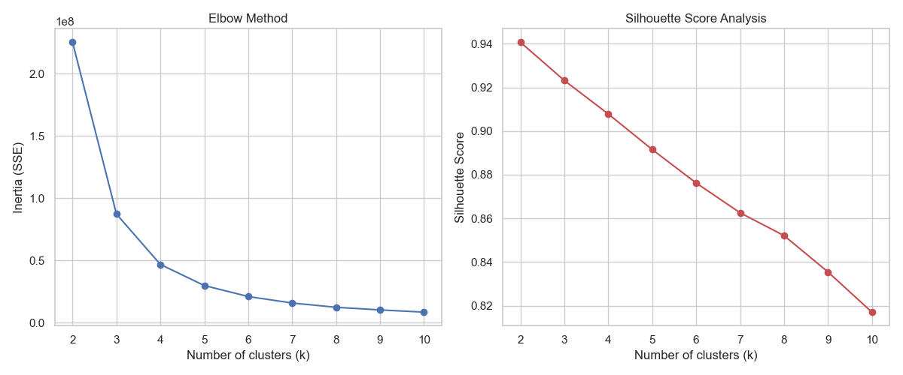
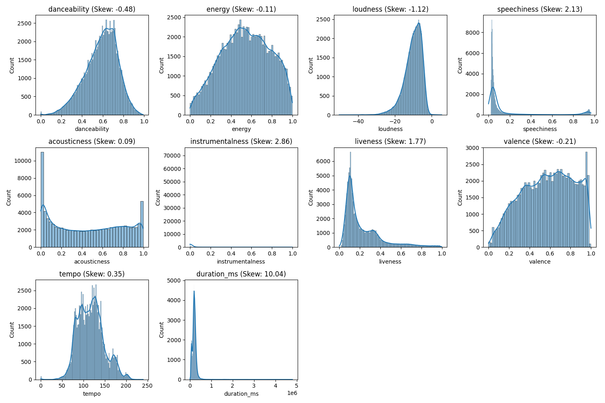
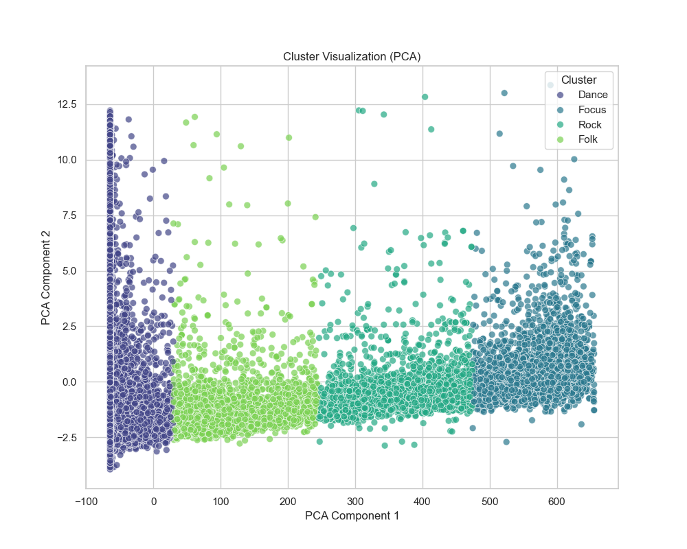
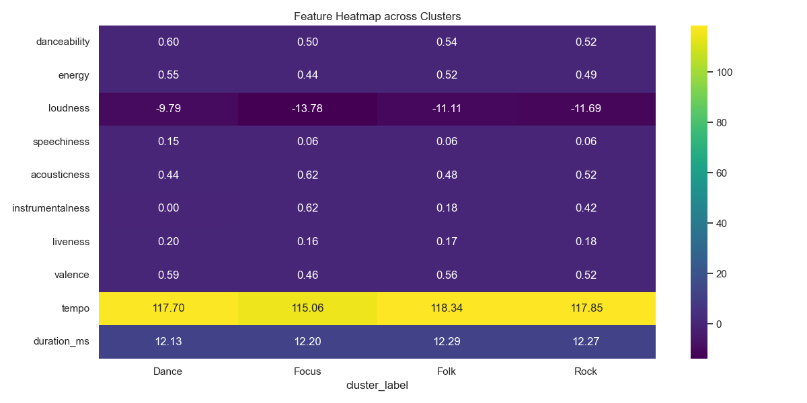
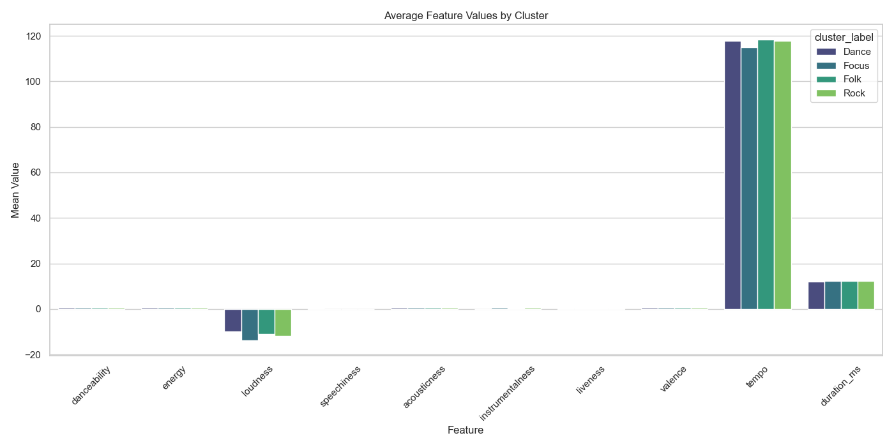

# Amazon Music Clustering - Project Insights

## 1. Executive Summary
This project successfully applied unsupervised machine learning techniques to categorize Amazon Music tracks into distinct clusters. Using K-Means clustering on audio features, we identified **4 distinct listener personas/musical styles**.

## 2. Methodology

### Determining Optimal K (Number of Clusters)
To determine the optimal number of clusters (*k*), we utilized two quantitative methods:
1.  **Elbow Method**: We plotted the sum of squared distances (Inertia) against *k* to identify the point where adding more clusters yields diminishing returns (the "elbow").
2.  **Silhouette Score**: We calculated the Silhouette Coefficient for various *k* values. The score measures how similar an object is to its own cluster compared to other clusters. We selected optimal *k* where the silhouette score was maximized, ensuring tight and well-separated clusters.

### Outlier Handling & Preprocessing
To ensure robust clustering:
*   **Outlier Treatment**: We opted for a **relaxed approach** to outlier removal. Strict removal (e.g., 1.5 IQR) resulted in excessive data loss and reduced cluster quality. Instead, we relied on Robust Scaler to handle extreme values.
*   **Log Transformation**: Skewed features (`speechiness`, `liveness`, `instrumentalness`, `duration_ms`) were log-transformed (`np.log1p`) to normalize their distributions, as audio features often follow power laws.
*   **Scaling**: We used `RobustScaler` to scale features, which is less sensitive to outliers than Standard Scaler.

## 3. Cluster Analysis & Interpretation
Based on the data features (Valence, Danceability, Energy, Acousticness, etc.), we have mapped the clusters to the following descriptive names:

### **Cluster 0: "Dance" (Upbeat Pop / Dance)**
*   **Characteristics**: High Valence, High Danceability, High Energy.
*   **Interpretation**: This group represents the most energetic and positive songs. Likely to contain pop hits, dance tracks, and party music.
*   **Key Features**: `danceability` (High), `valence` (High), `energy` (High).

### **Cluster 1: "Focus" (Acoustic Instrumental / Focus)**
*   **Characteristics**: High Acousticness, High Instrumentalness, Low Energy, Low Loudness.
*   **Interpretation**: Mostly instrumental tracks suitable for studying, working, or relaxation. Vocals are rare (Low Speechiness).
*   **Key Features**: `acousticness` (High), `instrumentalness` (High), `energy` (Low).

### **Cluster 2: "Rock" (Energetic Vocal / Rock)**
*   **Characteristics**: Moderate-High Energy, High Tempo, Low Instrumentalness.
*   **Interpretation**: Energetic songs with vocals, likely covering rock, traditional pop, or indie genres. Less dance-focused than Cluster 0 but still high energy.
*   **Key Features**: `tempo` (High), `energy` (Mod-High), `instrumentalness` (Low).

### **Cluster 3: "Folk" (Happy Acoustic / Folk)**
*   **Characteristics**: High Valence, High Acousticness, Moderate Instrumentalness.
*   **Interpretation**: A blend of acoustic textures with a positive, happy mood. likely to include Folk, Country, or acoustic Pop.
*   **Key Features**: `valence` (High), `acousticness` (High).

## 4. Visualizations

### Cluster Separation (PCA)
The 2D PCA projection shows clear separation between the "Focus" (Instrumental) group and the others. "Dance" and "Rock" share some overlapping energy traits but are distinct in danceability/valence.

### Feature Heatmap
The heatmap highlights the dominant features for each cluster, confirming our interpretations (e.g., high Instrumentalness for "Focus").

### Feature Comparison
Average values for key features across the 4 clusters.

## 5. Conclusion & Recommendations
*   **Personalization**: These clusters can be directly used to seed playlists (e.g., "Focus Mode", "Friday Night Party").
*   **Recommendation Engine**: Users listening to songs in "Folk" can be safely recommended other songs from that cluster.
*   **Content Acquisition**: If the "Focus" cluster has high engagement but low inventory, acquire more instrumental rights.
